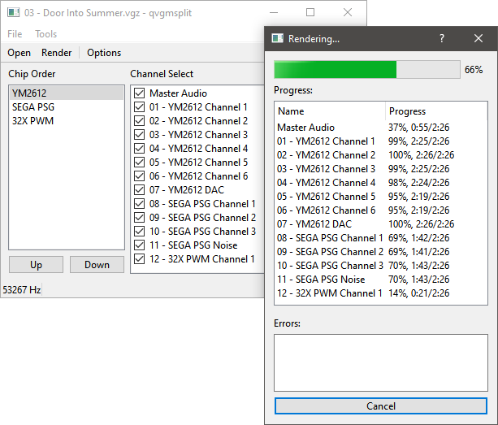

# qvgmsplit

A cross-platform multithreaded Qt-based app to split .vgm files into a .wav file for each channel.

This program renders audio using ValleyBell's [libvgm](https://github.com/ValleyBell/libvgm), a modular rewrite of vgmplay. qvgmsplit renders each .wav file in parallel on a separate thread, which is several times faster than single-threaded rendering on modern multi-core CPUs.

## Install

On Windows, download a release from [Releases](https://github.com/nyanpasu64/qvgmsplit/releases) and extract it to a folder. To instead download the latest nightly build, visit [nightly.link](https://nightly.link/nyanpasu64/qvgmsplit/workflows/windows-clang-vcpkg.yaml/master), then download and extract a "Release-exe" .zip file. If you are logged into GitHub, you can view and download nightly and PR builds in [Actions](https://github.com/nyanpasu64/qvgmsplit/actions).

On other platforms, you currently have to build qvgmsplit yourself. qvgmsplit depends on a recent C++ compiler, Qt, and zlib. zlib can be installed from Linux/MSYS2 package managers or vcpkg. I do not recommend installing Qt from vcpkg (which compiles it from source, a very slow process); Qt can be installed from Linux/MSYS2 package managers, the Qt web installer, or aqtinstall.

## Usage

Run qvgmsplit\[.exe\], then click Open or drag a .vgm/.vgz file onto the program (.dro, .s98, and .gym files may work as well). Alternatively you can drag a file onto qvgmsplit.exe in File Explorer.

After loading a song, select the channels to be recorded, and click Render and select a path to write to.

You can change the output .wav sampling rate by clicking Options. More settings may be added later.

## Roadmap

See [Issues](https://github.com/nyanpasu64/qvgmsplit/issues). qvgmsplit should mostly work, but enhancements may not be implemented soon due to lack of motivation.

## Thanks

This program was built on ValleyBell's [libvgm](https://github.com/ValleyBell/libvgm), and discussions with members of the Discord server, The Fourth Modulator.

## Contributing

Bug reports and feedback are encouraged; use [Issues](https://github.com/nyanpasu64/send-to-start/issues) for bugs and [Discussions](https://github.com/nyanpasu64/send-to-start/discussions) for questions and comments. PRs are welcome, but will be accepted at my discretion.

## License

The code in src/ is licensed under the [GNU General Public License v3.0 only](LICENSE), by [nyanpasu64](https://github.com/nyanpasu64) (this is not firmly decided yet). All contributed code from other authors will be licensed under the Apache License 2.0 (GPL-compatible) to allow switching to a more permissive license, though this is not firmly decided either.

The exact license of libvgm is unclear, since it includes both GPL and no-license-supplied emulation cores. It may not be strictly legal to redistribute these emulation cores, or combine them with GPL code. *don't sue me please*

Aside from libvgm, this program statically links to the libraries fmt, GSL, and STX, distributed under MIT and similar licenses. It dynamically links to Qt 5.15 under LGPL.
